# Microservicios para gestión de presupuestos

Proyecto basado en arquitectura de microservicios desarrollado con Spring Boot, Spring Cloud y Spring Data JPA, que permite administrar presupuestos de proyectos.
Incluye integración con MySQL y PostgreSQL, un Config Server, Eureka Server para el descubrimiento de servicios, y un API Gateway para el enrutamiento de solicitudes.
Se ha implementado el patrón Circuit Breaker para mejorar la resiliencia de la comunicación entre microservicios.

## Tecnologías y herramientas utilizadas
- Java 17
- Spring (Spring Boot, Spring Data JPA, Spring Cloud)
- Hibernate (para la persistencia de datos)
- MySQL (gestor para la base de datos de ppto-contrata)
- PostgreSQL (gestor para la base de datos de ppto-origen)
- Maven (como gestor de proyectos)
- Postman (documentación)
- Resilience4j (para Circuit Breaker)

## Funcionalidades principales
- CRUD de presupuestos para los microservicios ppto-contrata y ppto-origen.
- Comunicación de microservicios mediante WebClient.
- Eureka Server para el registro de microservicios. 
- Config Server para centralizar la configuración de los microservicios.
- Api Gateway para el enrutamiento de las solicitudes.
- Patrón Circuit Breaker para evitar sobrecargar servicios que están temporalmente inactivos o con fallas.

## Arquitectura

```mermaid
flowchart TD
    user([👤 Usuario]) --> gateway[🌐 API Gateway]

    subgraph Microservicios
        contrata[📦 ppto_contrata]
        origen[📦 ppto_origen]
        eureka[🔎 Eureka Server]
        config[⚙️ Config Server]
    end

    subgraph Bases de Datos
        mysql[(🗄️ MySQL DB)]
        postgres[(🗄️ PostgreSQL DB)]
    end

    gateway --> contrata
    gateway --> origen

    contrata --> mysql
    origen --> postgres
    contrata --> config
    origen --> config
    gateway -->config
```



#Flujo:
El usuario realiza solicitudes al API Gateway, que enruta hacia los microservicios (ppto-origen o ppto-contrata). Estos se comunican con sus respectivas bases de datos y utilizan el Config-server para cargar su configuración. Ambos microservicios están registrados en Eureka-server para el descubrimiento dinámico.

## Ejecución del proyecto

### 1. Clonar el repositorio
```bash
git clone https://github.com/wilfredohuarotog/Microservicios-Gestion-de-presupuestos.git
```
### 2. Ingresar al directorio
```
cd Microservicios-Gestion-de-presupuestos
```
### 3. Ejecutar para cada microservicio:

Levantar cada microservicio en consolas separadas.

- Config-server:
```
mvn spring-boot:run -pl config-server
```
- Eureka-server:
```
mvn spring-boot:run -pl eureka-server
```
- Api-gateway:
```
mvn spring-boot:run -pl gateway
```
- Pptp-origen:
```
mvn spring-boot:run -pl ppto-origen
```
- Pptp-contrata:
```
mvn spring-boot:run -pl ppto-contrata
```

## Uso
- Los microservicio ppto-origen y ppto-contrata permiten operaciones CRUD.
### Endpoint especial:
- Obtener lista de pptos de la contrata que pertenecen a un ppto (origen) identificado por su ID: `GET http://localhost:8080/api/v1/p-contrata/p-origen/{id}`

### Documentación
`Documentación de endpoints disponible en Postman:` [Docuemntación en Postman](https://documenter.getpostman.com/view/46041910/2sB3QFRCPr)
