# Microservicios para gestión de prespuestos

Microservicios desarrollados con Spring Boot, Spring Data JPA y Spring Cloud, que permiten administrar presupuestos de proyectos. Incluye integración con MySQL y PostgreSQL, un Config Server, Eureka Server para descubrimiento de servicios, y un API Gateway para el enrutamiento de las rutas.

## Tecnologías y herramientas utilizadas
- Java 17
- Spring Boot (Web, Data JPA, Cloud)
- Hibernate
- MySQL
- PostgresSQL
- Maven
- Postman

## Funcionalidades principales
- Solicitudes CRUD para los microservicios ppto_contrata y ppto_origen.
- Comunicación de microservicios mediante WebClient.
- Eureka Server para el registro de microservicios. 
- Config Server para centralizar la configuración de los microservicios.
- Api Gateway para el enrutamiento de las solicitudes.
- Patrón Cirkuit Break para mitigar fallas en la comunicación entre microservicios.

## Arquitectura

```mermaid
graph TD
    user[👤 Usuario] --> gateway[🌐 API Gateway]

    gateway --> contrata[📦 ppto_contrata]
    gateway --> origen[📦 ppto_origen]
    gateway --> eureka[🔎 Eureka Server]
    gateway --> config[⚙️ Config Server]

    contrata --> mysql[(🗄️ MySQL DB)]
    origen --> postgres[(🗄️ PostgreSQL DB)]
    contrata --> config
    origen --> config
```




## Ejecución del proyecto

### 1. Clonar el repositorio
```
git clone https://github.com/wilfredohuarotog/API-RESTful.git
```
### 2. Ingresar al directorio
```
cd clientes
```
### 3. Configuración de variables de entorno del application.properties
```
spring.datasource.url=${DB_URL}
spring.datasource.username=${DB_USER}
spring.datasource.password=${DB_PASSWORD}
```
### 4. Ejecutar 
```
mvn spring-boot:run
```
### 5. Accede a la documentación
`Documentación`: http://localhost:8080/swagger-ui.html.

## Despliegue en docker
### 1. Generar las imagenes y levantar el servicios del docker-compose.yml
```
docker compose up -build -d
```
### 2. Detener la ejecución
```
docker compose down
```
## Uso
### Endpoints
- Obtener lista de clientes: `GET http://localhost:8080/api/v1/clientes`
- Obtener cliente por ID: `GET http://localhost:8080/api/v1/clientes/{id}`
- Guardar/crear un cliente: `POST http://localhost:8080/api/v1/clientes`
- Actualizar datos de un cliente por su ID: `PUT http://localhost:8080/api/v1/clientes/{id}`
- Eliminar un cliente por su ID: `DELETE http://localhost:8080/api/v1/clientes/{id}`
